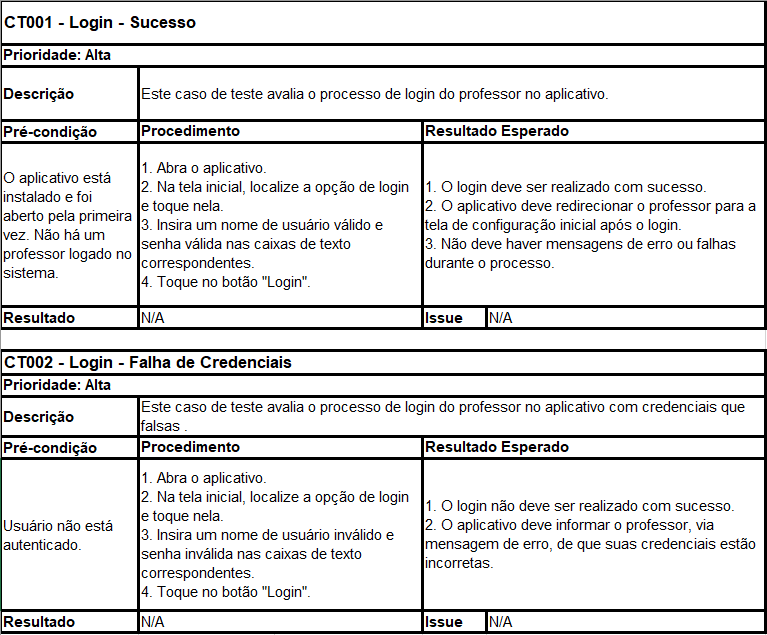
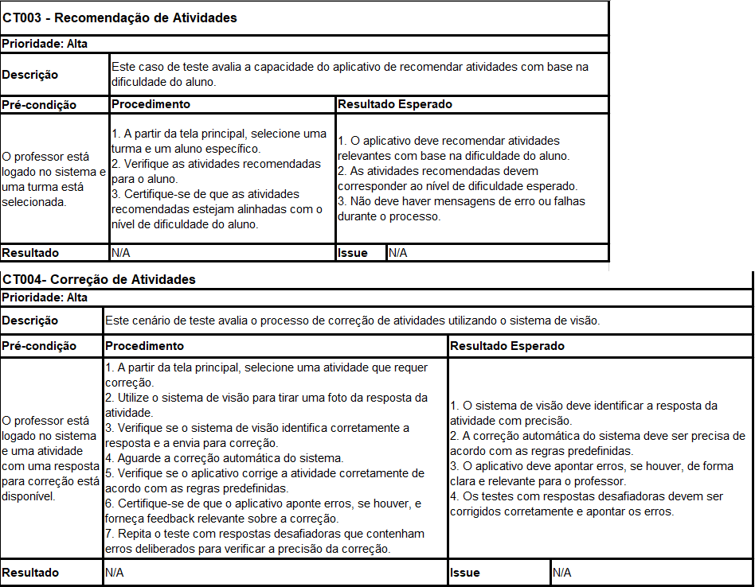
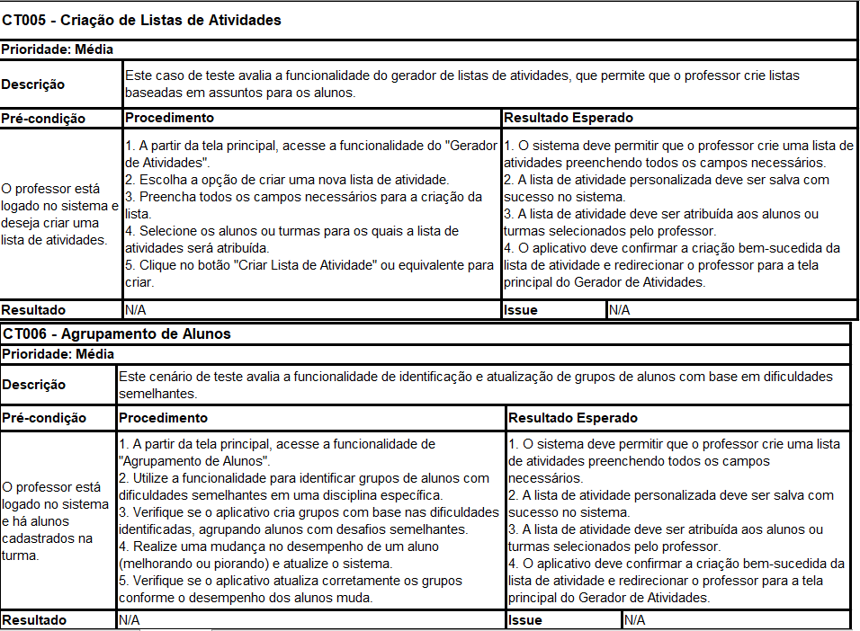
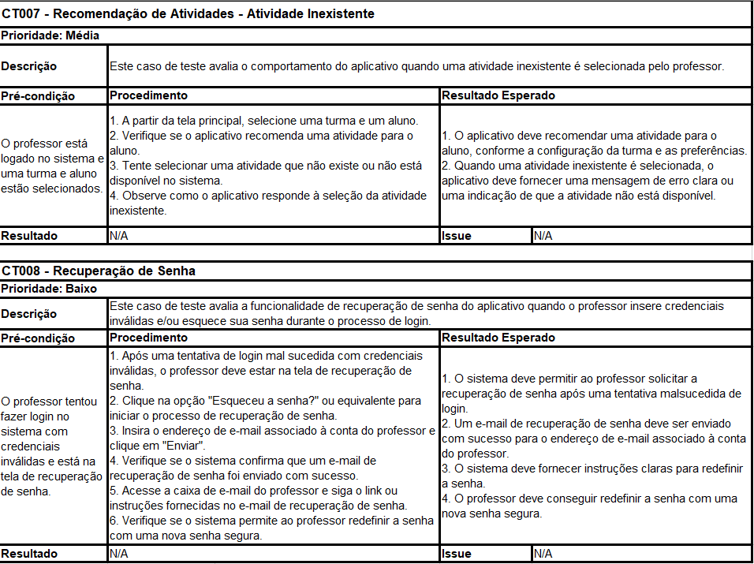

# Roteiro de Teste - Aplicativo de Ensino de Matemática

**Introdução:**  

A garantia de qualidade desempenha um papel crucial no desenvolvimento de qualquer aplicativo ou sistema de software. Uma parte fundamental desse processo é a criação e execução de casos de teste que avaliam diferentes aspectos do sistema. Neste documento, apresentaremos uma visão geral dos casos de teste desenvolvidos, estruturados com base no texto fornecido, e organizados de acordo com a prioridade de cada funcionalidade.

**Objetivo do Teste:** 

Avaliar a funcionalidade básica do aplicativo e a capacidade de recomendação de atividades de acordo com a dificuldade do aluno, bem como o processo de correção de atividades por meio do sistema de visão.

**Estrutura e Organização dos Casos de Teste:** 

Os Casos de Teste(CT) foram estruturados com base nas funcionalidades essenciais do sistema, conforme descrito no texto apresentado. Cada caso de teste aborda uma funcionalidade específica e é estruturado da seguinte maneira:

- Descrição: Cada caso de teste é acompanhado de uma descrição que destaca a funcionalidade ou comportamento específico a ser avaliado.
- Pré-condição: É especificada uma pré-condição que define o estado necessário do sistema antes da execução do teste.
- Procedimento: O procedimento detalha os passos a serem seguidos para executar o teste, garantindo que ele esteja alinhado com a descrição da funcionalidade a ser avaliada.
- Resultado Esperado: O caso de teste inclui uma descrição dos resultados que se espera obter após a execução bem-sucedida do procedimento.

**Prioridade de Casos de Teste:**

A prioridade dos casos de teste foi atribuída com base na relevância e frequência de uso das funcionalidades do sistema. Casos de teste com maior importância estratégica receberam prioridades mais altas, enquanto funcionalidades menos críticas foram atribuídas a prioridades mais baixas.

- Casos de teste com prioridade alta são essenciais para a experiência do usuário e o funcionamento central do sistema.
- Casos de teste com prioridade média avaliam funcionalidades importantes que desempenham um papel significativo no uso do sistema.
- Casos de teste com prioridade baixa referem-se a funcionalidades que, embora sejam relevantes, podem ocorrer com menos frequência ou serem menos críticas para a experiência geral do usuário. 

Aqui estão os CTs desenvolvidos:

**Justificativa**

Por fim, a escolha e organização dos casos de teste foram baseadas nas informações fornecidas no texto tentando explorar as funcionalidades apresentadas e também demonstrar os tipos de prioridades. Isso garante que os casos de teste abordem as áreas críticas do sistema de maneira proporcional à sua importância e impacto na experiência do usuário. Ao executar esses casos de teste, o objetivo é identificar e resolver potenciais problemas, assegurando a qualidade e confiabilidade global do sistema.

